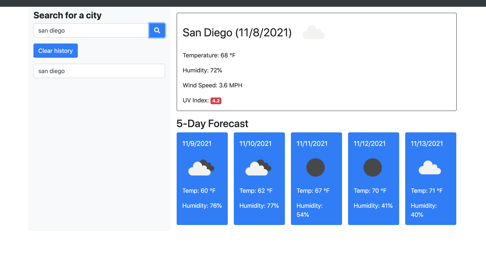

# weather-api

Lesson 6

## What does the WeatherAPI do?

This web application allows the user to look up the name of the city and it will then generate the weather of that city, as well as the weather for the next 5 days

## Languages

I used javascript, html, apis, and css

## What I learned

Creating this I learned about using web apis

## Screenshot

## Credits

worked with tutor and previous cohort to create this

